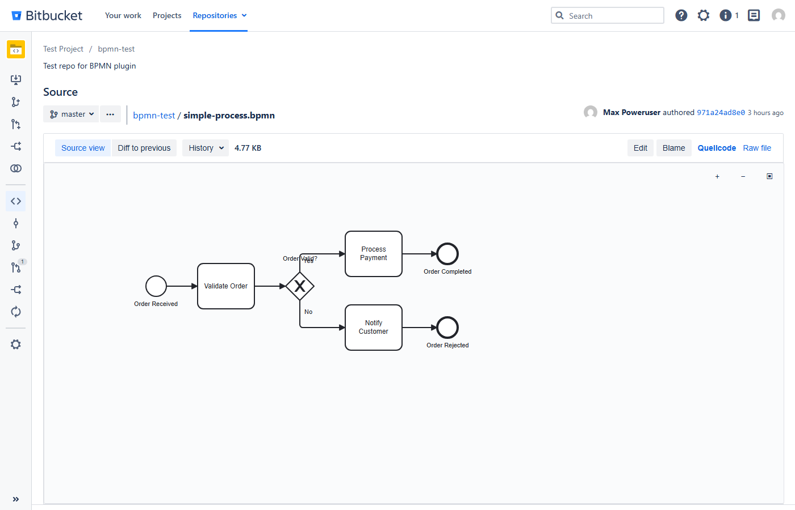
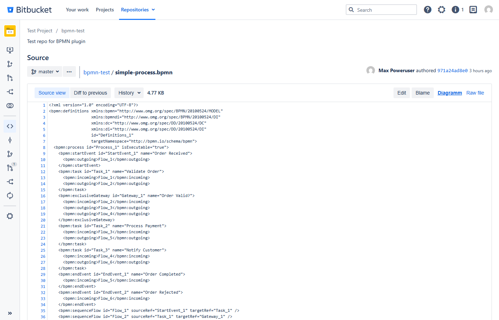
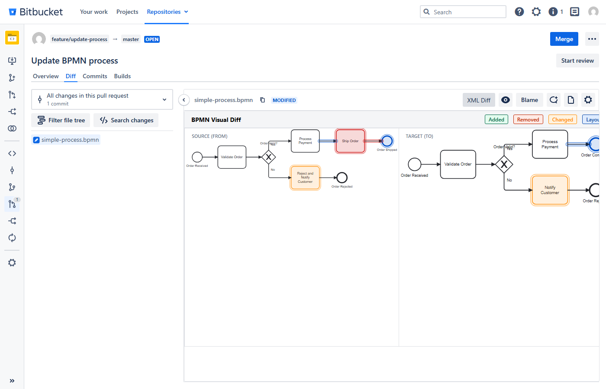
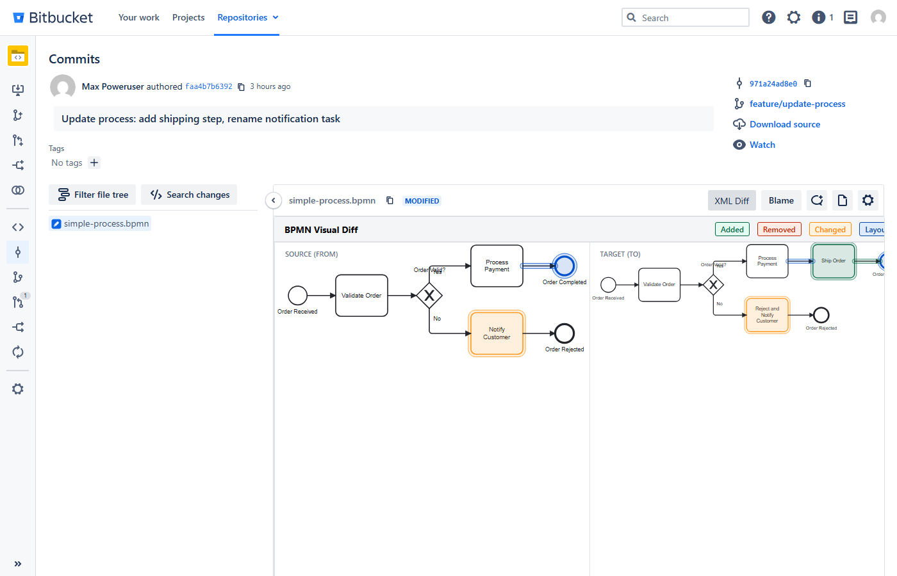
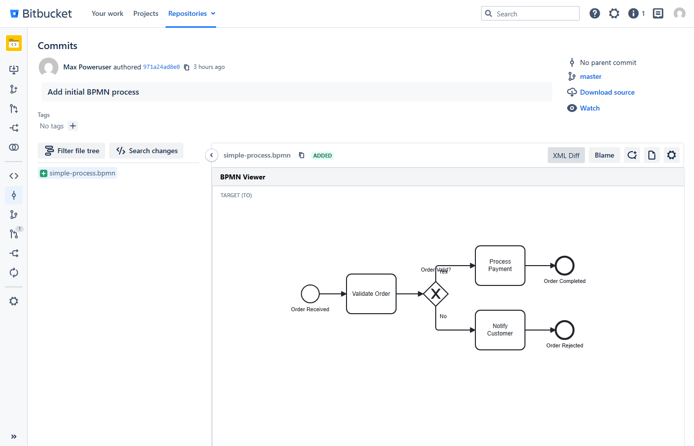

# BPMN Support for Bitbucket Data Center

A Bitbucket Data Center plugin that brings first-class support for [BPMN](https://www.bpmn.org/) files — visual diagram rendering when browsing repositories and side-by-side visual diffs in pull requests, commits, and branch comparisons.

Built on the open-source [bpmn.io](https://bpmn.io) toolkit.

Compatible with **Bitbucket Data Center 8.19+**.

> Originally forked from [bpmn-diff-bitbucket-plugin](https://github.com/domclick/bpmn-diff-bitbucket-plugin) by DomClick. This version is a complete rewrite with additional features, Bitbucket 8.x compatibility, and an embedded visual diff experience.

---

## Features

### BPMN File Viewer

When browsing a `.bpmn` file in a repository, the plugin automatically renders the process diagram instead of showing raw XML. A **Quellcode / Diagramm** toggle in the toolbar lets you switch between the visual diagram and the XML source.

- Interactive pan & zoom with dedicated controls (+, −, fit-to-viewport)
- Works with any branch or tag via the `?at=` parameter
- Seamlessly integrates into the existing Bitbucket file toolbar (next to Blame / Raw file)





### BPMN Visual Diff

Wherever Bitbucket shows a diff for a `.bpmn` file, a **BPMN Visual Diff** button appears. Clicking it replaces the XML diff with an inline side-by-side visual comparison. Changes are color-coded:

| Color | Meaning |
|-------|---------|
| 🟢 Green | Added elements |
| 🔴 Red | Removed elements |
| 🟠 Orange | Changed elements (properties modified) |
| 🔵 Blue | Layout-only changes (position/size) |

Click the button again (**XML Diff**) to toggle back to the standard text diff.

This works on all diff pages:

- **Pull Request diffs**
- **Commit diffs** (with automatic parent commit detection)
- **Branch comparisons** (Compare page)
- **Pull Request creation** (Compare tab)

For initial commits without a parent, the plugin shows a read-only BPMN viewer instead of a diff.







---

## Installation

### From Release

1. Download `bitbucket-bpmn-support-1.0.0.jar` from the [Releases](https://github.com/criew/bitbucket-bpmn-support/releases) page
2. Copy it to your Bitbucket shared plugins directory:
   ```
   <bitbucket-home>/shared/plugins/installed-plugins/
   ```
3. Restart Bitbucket (or wait for the plugin framework to pick it up)

### From Source

See [Building](#building) below.

---

## Building

### Prerequisites

- Java 11+
- Maven 3.9+ (or use the included Maven wrapper `mvnw` / `mvnw.cmd`)
- Node.js 18+ and npm

### Steps

```bash
# 1. Install frontend dependencies
npm install

# 2. Build webpack bundles (bpmn-js viewer + diff)
npm run build:prod

# 3. Build the Atlassian plugin JAR
./mvnw package -DskipTests
```

The plugin JAR will be at `target/bitbucket-bpmn-support-1.0.0.jar`.

---

## Architecture

### Plugin Structure

```
src/main/
├── java/                          # Server-side Java
│   └── .../BpmnDiffServlet.java   # Serves the visual diff page (standalone + embedded)
├── resources/
│   ├── atlassian-plugin.xml       # Plugin descriptor (web-resources, servlet, contexts)
│   ├── js/
│   │   ├── bpmn-file-handler.js   # File viewer: renders BPMN in browse pages
│   │   ├── bpmn-diff-button.js    # Diff button: adds toggle on all diff pages
│   │   ├── bpmn_diff.js           # Diff renderer: side-by-side comparison logic
│   │   └── bpmn_viewer.js         # Viewer bundle entry point (exports bpmn-js)
│   ├── css/                       # Stylesheets for viewer, diff markers, layout
│   └── velocity/
│       ├── bpmn-diff.vm           # Standalone diff page (with Bitbucket chrome)
│       └── bpmn-diff-embedded.vm  # Embedded diff page (for inline iframe)
config/
├── webpack.config.js              # Webpack config for viewer bundle
└── webpack.resources.config.js    # Webpack config for diff bundle
```

### How It Works

**File Viewer** (`bpmn-file-handler.js`):  
Loaded via WRM context `bitbucket.page.repository.fileContent`. A `MutationObserver` detects when the code view for a `.bpmn` file renders, hides it, and replaces it with a `bpmn-js` NavigatedViewer. A toggle button is inserted into the file toolbar.

**Visual Diff Button** (`bpmn-diff-button.js`):  
Loaded via WRM contexts for PR detail, commit detail, and compare pages. Scans the DOM for `.bpmn` filenames in diff headers, then injects a toggle button into the diff actions toolbar. On click, it fetches the necessary refs (PR data, commit parent, or branch names) and creates an iframe pointing to `BpmnDiffServlet` with `embedded=true`.

**Diff Renderer** (`bpmn_diff.js`):  
Runs inside the embedded iframe. Fetches both BPMN XML versions via the Bitbucket REST API, parses them with `bpmn-moddle`, computes the diff with `bpmn-js-differ`, renders both versions in side-by-side `bpmn-js` viewers, and applies color-coded CSS markers to changed elements.

### WRM Contexts

| Context | Page |
|---------|------|
| `bitbucket.page.repository.fileContent` | Repository file browse |
| `bitbucket.page.pullRequest.detail` | Pull request detail/diff |
| `bitbucket.page.commit.details` | Commit detail |
| `bitbucket.page.compare.and.create` | Branch compare & PR creation |

---

## Tech Stack

| Component | Purpose | License |
|-----------|---------|---------|
| [bpmn-js](https://github.com/bpmn-io/bpmn-js) | BPMN diagram rendering & interaction | bpmn.io License |
| [bpmn-js-differ](https://github.com/bpmn-io/bpmn-js-differ) | Semantic diff between two BPMN models | MIT |
| [bpmn-moddle](https://github.com/bpmn-io/bpmn-moddle) | BPMN 2.0 XML parsing | MIT |
| [camunda-bpmn-moddle](https://github.com/camunda/camunda-bpmn-moddle) | Camunda BPMN extension support | Apache 2.0 |
| [DOMPurify](https://github.com/cure53/DOMPurify) | HTML sanitization for safe rendering | Apache 2.0 / MPL 2.0 |
| [webpack](https://webpack.js.org/) | Frontend bundling | MIT |

> **Note on bpmn-js licensing**: bpmn-js uses the [bpmn.io license](https://bpmn.io/license/), which permits use in non-commercial and commercial projects. See their [license page](https://bpmn.io/license/) for details.

---

## Development

### Local Development with Docker

Start a local Bitbucket Data Center instance:

```bash
docker run -d --name bitbucket \
  -p 7990:7990 -p 7999:7999 \
  atlassian/bitbucket:8.19
```

Build and deploy the plugin:

```bash
npm install
npm run build:prod
./mvnw package -DskipTests

docker cp target/bitbucket-bpmn-support-1.0.0.jar \
  bitbucket:/var/atlassian/application-data/bitbucket/shared/plugins/installed-plugins/

docker restart bitbucket
```

### Running Tests

The project uses [Playwright](https://playwright.dev/) for end-to-end testing against a running Bitbucket instance:

```bash
npx playwright install chromium
node test-playwright.mjs
```

---

## Credits

- Originally forked from [bpmn-diff-bitbucket-plugin](https://github.com/domclick/bpmn-diff-bitbucket-plugin) by [DomClick](https://github.com/domclick)
- Diagram rendering powered by [bpmn.io](https://bpmn.io) — an open-source project by [Camunda](https://camunda.com/)

## License

[MIT](LICENSE)
